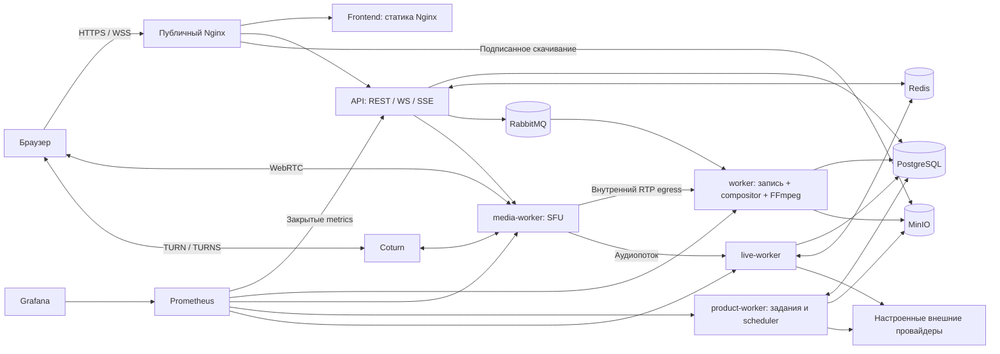

# Текущая архитектура Go Recorder / Meet

Документ описывает реализацию этапов 1–10 и текущую модель одного хоста Docker
Compose. Источник конфигурации выпуска —
[`docker-compose.production.yml`](../docker-compose.production.yml);
локальный [`docker-compose.yml`](../docker-compose.yml) имеет дополнительные
публикации портов и не является staging. Процедуры выпуска и восстановления:
[развёртывание](DEPLOYMENT.md), [релизы](RELEASE_PROCESS.md), [откат](ROLLBACK.md).

## Процессы приложения

Порты в таблицах — внутри контейнеров, кроме явно указанных публикаций хоста.
Readiness проверяет готовность зависимостей, а не только наличие HTTP-процесса.

| Сервис | Ответственность | Порты / зависимости | Постоянные данные | Health | Масштабирование |
| --- | --- | --- | --- | --- | --- |
| `frontend` | React/TypeScript/Vite, статические файлы и same-origin API proxy | 8080/TCP; API | В образе, записываемых бизнес-данных нет | `/healthz`, `/version.json` | Несколько экземпляров возможны за балансировщиком с согласованной версией; текущий Compose содержит один |
| `api` | Авторизация, встречи, REST, WS/SSE, права, постановка команд и заданий | 8085/TCP; PostgreSQL, Redis, RabbitMQ, MinIO, media-worker | Устойчивые данные в PostgreSQL/MinIO; активные сокеты в памяти | `/health/live`, `/health/ready`, `/version` | Общие хранилища позволяют несколько процессов; текущий proxy и Compose не реализуют бесшовный rolling pool |
| `media-worker` | SFU: маршрутизация RTP, политики устройств, egress для записи и аудио | 8091/TCP только внутри сети; публичные 50010/UDP и TCP по Compose; Redis | Активные комнаты и PeerConnection в памяти; аренды в Redis | `/health/live`, `/health/ready`, `/version` | Уникальные worker ID, адреса и сетевые порты для каждого экземпляра; живая миграция комнат отсутствует |
| `worker` | Захват записи, compositor, FFmpeg, проверка и публикация результатов | 8090/TCP внутри; PostgreSQL, Redis, RabbitMQ, MinIO, media-worker | Spool `/storage` на выделенном томе; результаты в MinIO, метаданные в PostgreSQL | `/health/live`, `/health/ready`, `/version`, проверка диска и consumer | Ограниченные параллельные задачи, аренды с поколениями; каждому экземпляру нужны собственная идентичность и корректное владение spool |
| `product-worker` | Постоянная очередь заданий, напоминания, интеграции, STT, ИИ, embeddings | 8092/TCP внутри; PostgreSQL, MinIO, настроенные провайдеры | `background_jobs` и результаты в PostgreSQL; временные медиа в `/tmp` | `/health/live`, `/health/ready`, `/version` | Конкурентный захват `SKIP LOCKED`, аренды и идемпотентность; масштаб ограничен бюджетом БД, памяти и провайдеров |
| `live-worker` | Потоковые субтитры и наблюдения для аналитики | 8093/TCP внутри; PostgreSQL, Redis, media-worker, live STT | Финальные реплики и агрегаты в PostgreSQL; текущие очереди в памяти | `/health/live`, `/health/ready`, `/version` | Ограниченные сессии/комнаты и аренды; отказ вспомогательной обработки не должен останавливать SFU |

Compositor встроен в `worker`; scheduler выполняется внутри существующих
процессов обработки. Отдельных сервисов compositor, scheduler, service mesh
или Kubernetes в текущем выпуске нет. `migrate` — одноразовая служебная задача
из API-образа, а не постоянно работающий сервис.

## Инфраструктура и хранение

| Сервис | Назначение / зависимости | Порты и публикация | Данные | Health и ограничение |
| --- | --- | --- | --- | --- |
| `proxy` | TLS, HTTPS/WSS, маршруты frontend/API/скачивания | Публичный 443/TCP | Конфигурация и сертификаты read-only | Проверка публичного HTTPS и выпуска через smoke; отдельный Compose healthcheck не задан |
| `coturn` | Релей WebRTC при невозможности прямого соединения | 3478/UDP+TCP, 5349/TCP; relay 49160–49259/UDP по умолчанию | Конфигурация, внешний secret и TLS-сертификат; живые allocation в памяти | HTTP health нет; требуется реальный forced-relay smoke, открытый порт этого не доказывает |
| `postgres` | Пользователи, права, история, jobs, тексты, аналитика; pgvector при включённом поиске | 5432/TCP, только private network | Том `postgres` | `pg_isready` плюс прикладные запросы; одиночный экземпляр, автоматического failover нет |
| `redis` | Presence, Pub/Sub, leases, билеты, rate limits, временные руки/реакции | 6379/TCP, только private network | В production Compose persistence выключен | `PING`; потеря Redis требует восстановления сессий и аренды, не является потерей PostgreSQL-истории |
| `rabbitmq` | Доставка команд записи с подтверждениями | 5672/TCP; management 15672 не опубликован | Том `rabbitmq` | `rabbitmq-diagnostics ping` и consumer readiness; одиночный брокер |
| `minio` | Приватные записи, превью, архивы дорожек, вложения | 9000/TCP; console 9001 не опубликована | Том `minio` | MinIO live endpoint и прикладные probes; одиночное хранилище, копия БД не заменяет копию объектов |
| `prometheus` | Метрики служб и правила alert | 9090/TCP, хост `127.0.0.1:19090` | Том `prometheus`, retention 7 дней в примере | `/-/ready`, состояние targets; профиль `observability`, без настроенной доставки alert сам по себе не уведомляет дежурного |
| `grafana` | Предоставленные dashboards | 3000/TCP, хост `127.0.0.1:13001` | Том `grafana`, provisioning, внешний пароль | `/api/health`; профиль `observability`, доступ через контролируемый канал |

Однохостовая схема имеет общие точки отказа: сам хост/диск, proxy, БД, Redis,
брокер, object storage и единственный media-worker. Имена томов не означают
резервирование или репликацию. Горизонтальное увеличение API само по себе не
устраняет эти зависимости и не увеличивает сетевую ёмкость SFU.

## Границы ответственности и завершение

API управляет правами и сигнализацией; RTP между участниками передаёт SFU.
FFmpeg не работает в обработчике API и не декодирует медиа внутри SFU.
Отдельные ограниченные очереди отделяют запись/распознавание от живого звонка.
Недоступность ИИ не является основанием считать видеосвязь успешной или неуспешной.

Внутренний `POST /operations/drain` с `METRICS_SECRET` снимает readiness и
останавливает приём новых работ там, где подключён обработчик сервиса.
`GET /operations/drain` показывает `draining`, `active`, `ready` без идентификаторов
задач. Возврата этого процесса в ready после drain нет. `active` учитывает
незавершённые прикладные HTTP-запросы и подключённый счётчик работ сервиса;
у API к нему относятся локальные WebSocket-подключения. Это проверка наличия
работы в конкретном процессе, а не общая метрика пользователей всего кластера.

Перед заменой процесса оператор ждёт завершения активной работы. SIGTERM запускает
ограниченное по времени завершение; стандартный `SHUTDOWN_TIMEOUT` — 20 секунд,
Compose grace period — 45 секунд. Длинная встреча или запись может не успеть
закончиться. Принудительная замена SFU потребует переподключения клиентов, а
прерванный активный capture нельзя объявлять непрерывной успешной записью.
Готовые закрытые сегменты и аренды позволяют восстанавливать предусмотренные
этапы финализации, но не обещают бесшовное продолжение захвата.

Публичный proxy закрывает `/health`, `/metrics`, `/internal`, `/operations` и
`/debug`. `/version` и `/version.json` раскрывают только проверенные метки артефакта.
Разрешения пользователя и admin проверяются сервером; интерфейс не является
границей безопасности. Состав передаваемых данных — [DATA_FLOWS.md](DATA_FLOWS.md).

## Контракты, пределы и исторические измерения

Точки входа и текущие ограничения собраны в [API.md](API.md). Фактические значения
задают [`internal/config/`](../internal/config), проверенный env-файл выпуска
и router/usecase ограничения; увеличение лимита не подтверждает ёмкость оборудования.

[Stage 6 capacity baseline](CAPACITY_BASELINE.md),
[отчёт production hardening](operations/production-hardening-report.md) и
[Stage 9 UX report](operations/PRODUCT_UX_RELEASE_REPORT.md) — исторические
результаты конкретных локальных прогонов. Они не подтверждают текущий staging,
внешний TURN, production SLO или готовность этого выпуска. Исторические описания
«не реализовано» в документах ранних этапов читаются в контексте того этапа;
текущая инвентаризация и исполняемые маршруты имеют приоритет.
